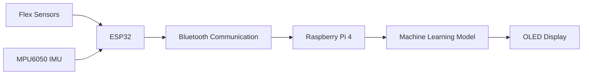

# Sign Language Translator Using a Smart Glove

## Overview

This repository contains the design, implementation, and documentation of a wearable sign language translation system developed using embedded systems, wireless communication, and machine learning.

The system uses a smart glove equipped with flex sensors and an MPU6050 inertial measurement unit (IMU) to capture finger bending and hand movement data. An ESP32 microcontroller acquires sensor readings and transmits them wirelessly to a Raspberry Pi 4 via Bluetooth. A machine learning model running on the Raspberry Pi classifies the performed gesture and displays the recognized sign on an OLED display.

This project was developed as an undergraduate IoT and Machine Learning project at the Institute of Technical Education and Research (ITER), Siksha 'O' Anusandhan University.

---

## Demonstration

### Smart Glove Assembly

Insert image:

`assets/images/glove.jpg`

### System Architecture

Insert image:

`assets/images/system_architecture.png`

### OLED Output

Insert image:

`assets/images/oled_output.jpg`

### Project Demonstration Video

Insert video or GIF link here.

---

## System Architecture



### System Workflow

1. Flex sensors measure finger bending.
2. MPU6050 measures hand orientation and motion.
3. ESP32 collects sensor readings.
4. Sensor data is transmitted via Bluetooth.
5. Raspberry Pi receives incoming sensor data.
6. A trained machine learning model predicts the gesture.
7. The recognized gesture is displayed on the OLED screen.

---

## Hardware Components

| Component                           | Quantity    |
| ----------------------------------- | ----------- |
| ESP32 Development Board             | 1           |
| Raspberry Pi 4                      | 1           |
| MPU6050 Accelerometer and Gyroscope | 1           |
| Flex Sensors                        | 5           |
| OLED Display (128×64)               | 1           |
| TP4056 Charging Module              | 1           |
| 3.7V Li-Ion Battery                 | 1           |
| Resistors                           | 5           |
| Connecting Wires                    | As Required |
| Smart Glove                         | 1           |

---

## Software Stack

### ESP32 Firmware

* Arduino Framework
* BluetoothSerial
* Wire
* MPU6050 Library

### Raspberry Pi

* Python 3
* NumPy
* Pandas
* Scikit-Learn
* Joblib
* PySerial
* Pillow
* Adafruit SSD1306 Library

---

## Dataset Structure

The machine learning model uses the following features:

| Feature |
| ------- |
| flex1   |
| flex2   |
| flex3   |
| flex4   |
| flex5   |
| ax      |
| ay      |
| az      |
| gx      |
| gy      |
| gz      |
| label   |

### Sensor Description

* flex1–flex5: Finger bending measurements
* ax, ay, az: Accelerometer readings
* gx, gy, gz: Gyroscope readings
* label: Corresponding gesture class

---

## Machine Learning Pipeline

### Data Collection

Sensor data is collected using the smart glove and transmitted from the ESP32 to the Raspberry Pi.

### Data Cleaning

The dataset is cleaned by:

* Removing missing values
* Removing duplicate samples
* Filtering invalid sensor readings
* Normalizing gesture labels

### Feature Scaling

The dataset is standardized using Scikit-Learn's StandardScaler.

### Model Training

The project uses a Random Forest Classifier.

Training configuration:

```python
RandomForestClassifier(
    n_estimators=200,
    random_state=42,
    n_jobs=-1
)
```

### Model Deployment

The trained model and scaler are serialized using Joblib and deployed on the Raspberry Pi for real-time inference.

---

## Repository Structure

```text
sign-language-translator/

├── firmware/
│   └── smart_glove/
│       └── smart_glove.ino

├── raspberry_pi/
│   ├── collect_data.py
│   ├── clean_dataset.py
│   ├── train_model.py
│   ├── inference.py
│   ├── generate_synthetic_data.py
│   └── requirements.txt

├── dataset/
│   ├── raw/
│   └── cleaned/

├── models/

├── docs/
│   ├── architecture.md
│   ├── hardware_setup.md
│   ├── wiring_guide.md
│   ├── dataset.md
│   ├── benchmarks.md
│   └── original_project_report.docx

├── scripts/
│   ├── bluetooth_setup.sh
│   └── install.sh

├── systemd/

├── assets/

├── README.md

└── LICENSE
```

---

## Installation

### Install System Dependencies

```bash
sudo apt update

sudo apt install -y \
python3 \
python3-pip \
python3-venv \
bluetooth \
bluez \
bluez-tools \
i2c-tools
```

### Install Python Dependencies

```bash
cd raspberry_pi

pip3 install -r requirements.txt
```

---

## Usage

### Train the Model

```bash
python3 train_model.py \
--dataset ../dataset/cleaned/gesture_data_clean.csv \
--model-dir ../models
```

### Run Real-Time Inference

```bash
python3 inference.py \
--port /dev/rfcomm0 \
--model-dir ../models
```

### Generate Synthetic Test Data

Synthetic data is provided only for testing and pipeline validation.

```bash
python3 generate_synthetic_data.py \
--samples 100 \
--output ../dataset/raw/gesture_data_raw.csv
```

---

## Results

The completed system successfully demonstrated:

* Real-time gesture recognition
* Bluetooth communication between ESP32 and Raspberry Pi
* Sensor-based gesture classification
* OLED display output
* Portable battery-powered operation

The original project report describes reliable real-time performance with low latency during testing.

---

## Limitations

* Recognition is limited to predefined gesture classes.
* Dynamic sign language sequences are not supported.
* Voice output is not implemented.
* Recognition accuracy may vary between users due to hand size and sensor placement differences.
* Bluetooth communication range is limited.

---

## Future Improvements

Potential future enhancements include:

* Text-to-Speech output
* Mobile application integration
* Expanded gesture vocabulary
* Dynamic gesture recognition
* Improved user calibration
* Deep learning based gesture classification

These features were not part of the original implementation.

---

## Project Authenticity Notes

This repository was reconstructed using:

* The original project report
* Recovered ESP32 firmware
* Recovered Raspberry Pi source code
* Recovered machine learning scripts

Some artifacts, including the original dataset and trained model files, were not recovered and have been recreated where necessary to preserve repository functionality.

The final firmware implementation reads flex sensor values directly using ESP32 ADC pins.

The project report also documents an MCP3008-based hardware configuration. Both configurations are documented for completeness.

---

## Contributors

* S. Jayant Kumar
* Veetesh Sinha
* Swayam Das
* Anubhab Patra
* Smruti Sourav Mishra
* Saadiya Farheen

---

## License

This project is licensed under the MIT License.

See the LICENSE file for details.
