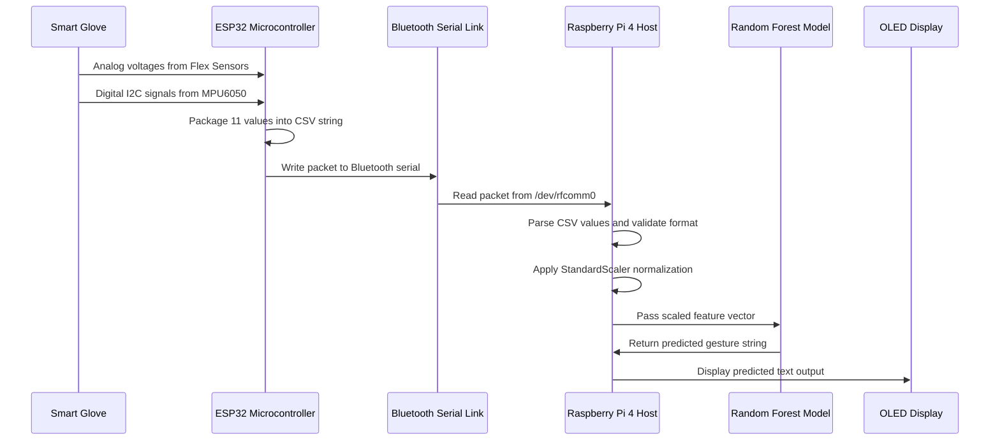
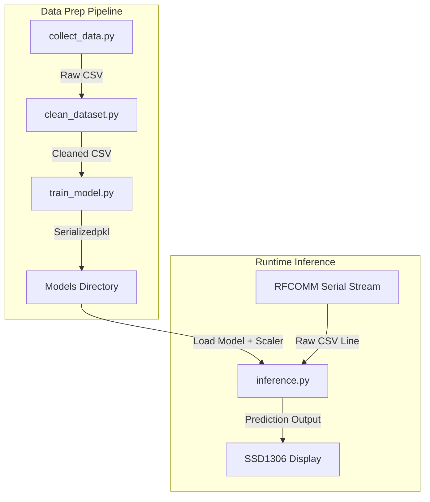

# System Architecture

This document describes the hardware and software architecture of the Smart Glove Sign Language Translator system. It details the component blocks, communication protocols, module structures, and data flows.

---

## System Overview

The Smart Glove Sign Language Translator is a two-stage embedded system designed to capture hand gestures via wearable sensors and translate them into recognized gesture characters using a machine learning model running on a Raspberry Pi host.

The system consists of:

1. **Smart Glove Sensor Node**: A wearable glove equipped with five flex sensors (one per finger) and an MPU6050 IMU (accelerometer + gyroscope). The ESP32 microcontroller collects these sensor readings, packages them into a CSV formatted string, and transmits the packets over a Bluetooth link.
2. **Inference Host Unit**: A Raspberry Pi 4 single-board computer receives the Bluetooth serial data stream, performs real-time preprocessing and feature scaling, executes a Random Forest classifier model, and updates an SSD1306 OLED display.

```mermaid
graph LR
    subgraph Glove [Smart Glove Sensor Node]
        F [Flex Sensors] --> ESP [ESP32 Microcontroller]
        I [MPU6050 IMU] --> ESP
    end

    ESP -->|Bluetooth Serial| RPI [Raspberry Pi 4 Host]

    subgraph Host [Host System]
        RPI --> ML [Random Forest Classifier]
        ML --> OLED [SSD1306 OLED Display]
    end
```

---

## Data Flow

The following sequence diagram illustrates the data flow from physical hand movement to displayed text.



### System Latency Budget

The table below breaks down the latency for each stage of the system.

| Stage | Process | Typical Duration | Interface |
|-------|---------|------------------|-----------|
| 1 | Sensor sampling (Flex + IMU) | 5.0 ms | ADC / I2C |
| 2 | Data packaging on ESP32 | 0.5 ms | CPU |
| 3 | Bluetooth Classic transmission | 15.0 ms | RF SPP |
| 4 | Serial read and parsing on Host | 2.0 ms | RFCOMM |
| 5 | StandardScaler preprocessing | 0.2 ms | CPU |
| 6 | Random Forest inference | 3.0 ms | CPU |
| 7 | OLED display screen update | 5.0 ms | I2C |
| **Total** | **End-to-End Latency** | **30.7 ms** | — |

---

## Software Architecture

### ESP32 Firmware Module structure
The ESP32 firmware is written in C++ and organized into functional routines inside [smart_glove.ino](../firmware/smart_glove/smart_glove.ino):

- **Sensor Reading**: Reads raw voltages from the five flex sensors using internal ADC pins `32`, `33`, `34`, `35`, `36`. Reads raw accelerometer and gyroscope registers from the MPU6050 using I2C.
- **Data Packaging**: Concatenates values into a CSV formatted ASCII line. Accelerometer and gyroscope data are normalized by their respective sensitivity factors (`16384.0` LSB/g and `131.0` LSB/deg/s).
- **Bluetooth Transmission**: Writes the packaged ASCII line to the `BluetoothSerial` output buffer at 50ms intervals (~20 Hz).
- **Client Connection Monitoring**: Monitors connection status. If a client is not connected for longer than 30 seconds, it restarts Bluetooth advertising.

### Host Application Modules
The Raspberry Pi host scripts are written in Python and split into specific files to handle data collection, cleaning, training, and real-time inference:



### Module File Reference

| File | Type | Description |
|------|------|-------------|
| [smart_glove.ino](../firmware/smart_glove/smart_glove.ino) | ESP32 Firmware | Performs hardware initialization, reads analog and I2C sensors, and manages Bluetooth Serial advertising and transmissions. |
| [collect_data.py](../raspberry_pi/collect_data.py) | Python Script | Connects to `/dev/rfcomm0`, prompts the user for gesture labels, and saves streaming sensor lines into raw CSV training datasets. |
| [clean_dataset.py](../raspberry_pi/clean_dataset.py) | Python Script | Reads raw dataset CSV files, removes duplicate and null values, filters out extreme readings, and uses IQR per class to remove outliers. |
| [train_model.py](../raspberry_pi/train_model.py) | Python Script | Reads clean datasets, fits a `StandardScaler`, splits features stratified, trains a `RandomForestClassifier`, and outputs serialized `.pkl` files. |
| [inference.py](../raspberry_pi/inference.py) | Python Script | Loads the scaler and model, opens the Bluetooth port, runs preprocessing and predictions on incoming lines, and updates the I2C OLED display. |

---

## Communication Protocol

### Physical Layer
- **Interface**: Bluetooth Classic
- **Profile**: Serial Port Profile (SPP)
- **Baud Rate**: 115200
- **Device Broadcast Name**: `ESP32_GLOVE`
- **Host Serial Node**: `/dev/rfcomm0`

### Packet Structure
Data is transmitted as ASCII-encoded, comma-separated strings terminated by a newline character (`\n`):

```
flex1,flex2,flex3,flex4,flex5,ax,ay,az,gx,gy,gz\n
```

- **Flex 1 to 5**: Integer values representing analog readings (0–4095).
- **ax, ay, az**: Float values representing acceleration along the X, Y, and Z axes (in g, ±2g range).
- **gx, gy, gz**: Float values representing angular velocity around the X, Y, and Z axes (in deg/s, ±250 deg/s range).

Example Frame:
```
1850,2240,1920,2050,1640,0.124,-0.982,0.053,1.25,-0.42,0.18
```

---

## Directory Structure

Refer to the main [README.md](../README.md) for the complete directory structure mapping. Detailed hardware wiring mappings are located in [wiring_guide.md](wiring_guide.md).
